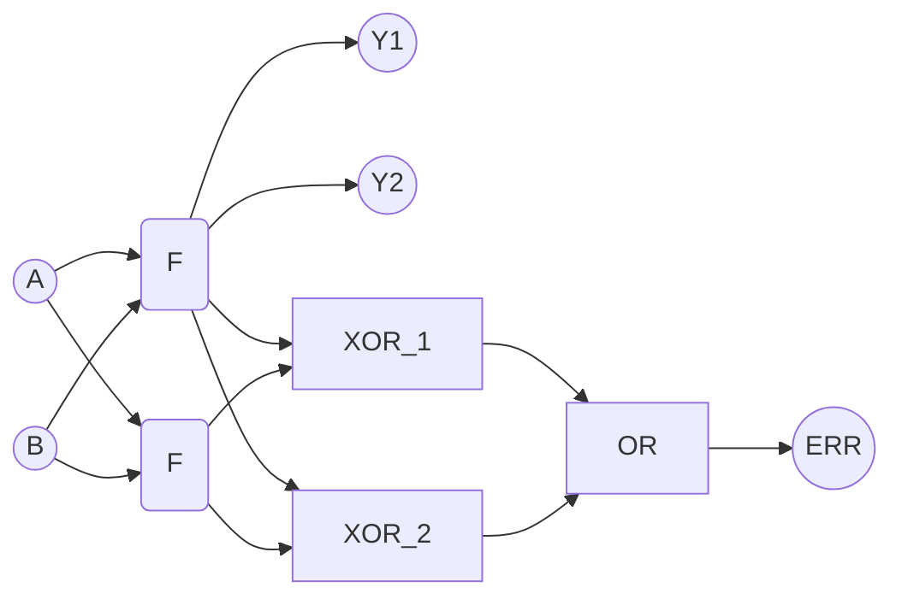
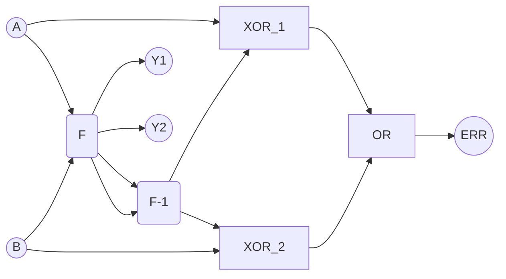

# Obvody bezpečné proti poruchám

TMR - triple module redundanci
Letadla - 5 násobná

Dopad radiace na pěměť
SEUs - Single event upsets

Parita zabezpečuje data
TMR zabezpečuje HW

> [!tip] Obvody bezpečné proti poruchám
Obvody je bezpečný pro jedno poruchy, jestliže pro každý vstupní vektor a poruchu platí že odezva je:
>- správná,
>- chybový stav.

Dostaneme stav chybu, nebo správný výsledek.

Obvodu TMR nejsou zabezpečené vůči chybám ve hlasovacím zařízení.

## Zdvojení logiky
2xF

F -> F-1

## Dvoudrátová logika
Proto z 74xx má negované výstupy.

Vyhodnocujeme najednou přímou a negovanou větev.